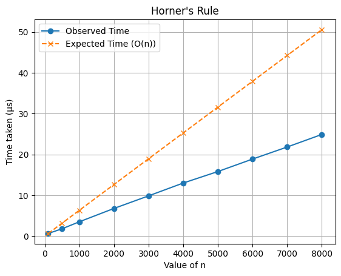

DSA Practical

### Practical 1. Horner's Rule

Problem Statement: Evaluate a polynomial for a given value of x using Horner's Rule.

Algorithm of Solution:

1. Start from the highest degree coefficient.
2. Recursively evaluate the remaining coefficients.
3. Multiply the recursive result by x and add the current coefficient.

Code:

double hornersRule(vector<double> &coefficients, int n, double x, int ind) {
if (ind==n-1) return coefficients[ind];
return coefficients[ind]+x\*hornersRule(coefficients, n, x, ind+1);
}

Graph:



Time Complexity: Best = Average = Worst = O(n)

Space Complexity: O(n)

### Practical 2. Linear Search

Problem Statement: Find the index of a target element in an array.

Algorithm of Solution:

1. Traverse the array from left to right.
2. Compare each element with the target.
3. Return the index when the target is found, otherwise return -1.

Code:

int linearSearch(vector<int> &arr, int n, int target) {
for (int i=0; i<n; i++) {
if (arr[i]==target) return i;
}
return -1;
}

Graph:

Time Complexity: Best = O(1), Average = Worst = O(n)

Space Complexity: O(1)

### Practical 3. Missing Number

Problem Statement: Find the missing number from a consecutive sequence.

Algorithm of Solution:

1. Scan the array from the second element onward.
2. Check whether the difference between adjacent numbers is 1.
3. When a gap is found, return the missing value.

Code:

int findMissingNumber(vector<int> &arr, int n) {
for (int i=1; i<n; i++) {
if (arr[i]-arr[i-1]!=1) {
return arr[i-1]+1;
}
}
return n+1;
}

Graph:

Time Complexity: Best = Average = Worst = O(n)

Space Complexity: O(1)

### Practical 4. Permutation Generation of Binary String

Problem Statement: Generate all binary strings of length n.

Algorithm of Solution:

1. Fix one position at a time.
2. Place 0 at the current position and recurse.
3. Place 1 at the current position and recurse again.

Code:

void permutationGenerationOfBinaryString(int n, int idx, string &current) {
if (idx==n) {
cout << current << "\n";
return;
}
current[idx]='0';
permutationGenerationOfBinaryString(n, idx + 1, current);
current[idx]='1';
permutationGenerationOfBinaryString(n, idx + 1, current);
}

Graph:

Time Complexity: Best = Average = Worst = O(2^n)

Space Complexity: O(n)

### Practical 5. Permutation Generation of String

Problem Statement: Generate all permutations of a given string.

Algorithm of Solution:

1. Choose a starting position.
2. Swap it with every character from the current position onward.
3. Recurse on the remaining suffix and then backtrack.

Code:

void permutationGenerationOfString(int n, int idx, string &s) {
if (idx==n) {
cout << s << "\n";
return;
}
for (int i=idx; i<n; i++) {
swap(s[i], s[idx]);
permutationGenerationOfString(n, idx + 1, s);
swap(s[i], s[idx]);
}
}

Graph:

Time Complexity: Best = Average = Worst = O(n \* n!)

Space Complexity: O(n)

### Practical 6. Power Iterative

Problem Statement: Calculate x raised to power n using iteration.

Algorithm of Solution:

1. Initialize the result as 1.
2. Multiply the result by x exactly n times.

Code:

int powerIterative(int x, int n) {
int result=1;
for (int i=0; i<n; i++) {
result\*=x;
}
return result;
}

Graph:

Time Complexity: Best = Average = Worst = O(n)

Space Complexity: O(1)

### Practical 7. Power Recursive

Problem Statement: Calculate x raised to power n using recursion.

Algorithm of Solution:

1. If the exponent is 0, return 1.
2. Recursively compute the half power.
3. Square the half power and multiply by x if the exponent is odd.

Code:

int powerRecursive(int x, int n) {
if (n==0) return 1;
int half=powerRecursive(x, n/2);
if (n%2==0) {
return half*half;
} else {
return x*half\*half;
}
}

Graph:

Time Complexity: Best = Average = Worst = O(log n)

Space Complexity: O(log n)

### Practical 8. Sum of Arrays

Problem Statement: Find the sum of all elements in an array.

Algorithm of Solution:

1. Start with sum = 0.
2. Add each array element to the running total.
3. Return the accumulated sum.

Code:

int sumOfArray(vector<int> &arr, int n) {
int sum=0;
for (int i=0; i<n; i++) {
sum+=arr[i];
}
return sum;
}

Graph:

Time Complexity: Best = Average = Worst = O(n)

Space Complexity: O(1)

### Practical 9. Tower of Hanoi

Problem Statement: Solve the Tower of Hanoi problem for n disks.

Algorithm of Solution:

1. Move n-1 disks from source to auxiliary.
2. Move the largest disk.
3. Move n-1 disks from auxiliary to destination.

Code:

void towerOfHanoi(int n, char source, char destination, char use) {
if (n==1) return;
towerOfHanoi(n-1, source, use, destination);
towerOfHanoi(n-1, use, destination, source);
}

Graph:

Time Complexity: Best = Average = Worst = O(2^n)

Space Complexity: O(n)

### Practical 10. Binary Search

Problem Statement: Find the index of a target element in a sorted array.

Algorithm of Solution:

1. Check the middle element of the current range.
2. If it matches the target, return the index.
3. Otherwise, search the left or right half recursively.

Code:

long long binarySearch(vector<long long> &arr, long long low, long long high, long long target) {
if (low>high) return -1;
long long mid=(low+high)/2;
if (arr[mid]==target) return mid;
else if (arr[mid]>target) return binarySearch(arr, low, mid-1, target);
else return binarySearch(arr, mid+1, high, target);
}

Graph:

Time Complexity: Best = O(1), Average = Worst = O(log n)

Space Complexity: O(log n)

### Practical 11. Insertion Sort

Problem Statement: Sort an array by building a sorted portion one element at a time.

Algorithm of Solution:

1. Start from the second element.
2. Compare the current element with elements on its left.
3. Shift larger elements right and insert the key in the correct position.

Code:

void insertionSort(vector<int> &arr) {
int n=arr.size();
for (int j=1; j<n; j++) {
int key=arr[j];
int i=j-1;
while (i>=0 && arr[i]>key) {
arr[i+1]=arr[i];
i--;
}
arr[i+1]=key;
}
for (int i=0; i<n; i++) {
cout << arr[i] << " ";
}
cout << endl;
}

Graph:

Time Complexity: Best = O(n), Average = Worst = O(n^2)

Space Complexity: O(1)

### Practical 12. Merge Sort

Problem Statement: Sort an array using the divide-and-conquer approach.

Algorithm of Solution:

1. Divide the array into two halves.
2. Recursively sort the left and right halves.
3. Merge the two sorted halves into one sorted array.

Code:

void merge(vector<long long> &arr, int lo, int mid, int hi) {
vector<int> temp;
int l=lo, r=mid+1;
while (l<=mid && r<=hi) {
if (arr[l]>=arr[r]) {
temp.push_back(arr[r++]);
} else {
temp.push_back(arr[l++]);
}
}
while (l<=mid) {
temp.push_back(arr[l++]);
}
while (r<=hi) {
temp.push_back(arr[r++]);
}
for (int i=lo; i<=hi; i++) {
arr[i]=temp[i-lo];
}
}

void mergeSort(vector<long long> &arr, int lo, int hi) {
if (lo>=hi) return;
int mid=(lo+hi)/2;
mergeSort(arr, lo, mid);
mergeSort(arr, mid+1, hi);
merge(arr, lo, mid, hi);
}

Graph:

Time Complexity: Best = Average = Worst = O(n log n)

Space Complexity: O(n)

### Practical 13. Quick Sort

Problem Statement: Sort an array using partition-based divide and conquer.

Algorithm of Solution:

1. Choose the last element as the pivot.
2. Partition the array so smaller elements go to the left and larger elements go to the right.
3. Recursively sort the two partitions.

Code:

int partition(vector<long long> &arr, int lo, int hi) {
int pivot=arr[hi];
int i=lo-1;
for (int j=lo; j<=hi-1; j++) {
if (arr[j]<pivot) {
i++;
swap(arr[i], arr[j]);
}
}
swap(arr[i+1], arr[hi]);
return i+1;
}

void quickSort(vector<long long> &arr, int low, int high) {
if (low<high) {
int pivot=partition(arr, low, high);
quickSort(arr, low, pivot-1);
quickSort(arr, pivot+1, high);
}
}

Graph:

Time Complexity: Best = Average = O(n log n), Worst = O(n^2)

Space Complexity: Best/Average = O(log n), Worst = O(n)

### Practical 14. Convex Hull

Problem Statement: Find the convex hull of a set of points in a 2D plane.

Algorithm of Solution:

1. Find the lowest point and use it as the pivot.
2. Sort all other points by polar angle around the pivot.
3. Traverse the sorted points and remove non-left turns using a stack.

Code:

struct Point {
int x, y;
};

Point p0;

long long crossProduct(Point a, Point b, Point c) {
return (b.x - a.x)_(c.y - a.y) - (b.y - a.y)_(c.x - a.x);
}

long long distSquared(Point a, Point b) {
return (a.x - b.x)_(a.x - b.x) + (a.y - b.y)_(a.y - b.y);
}

bool compare(Point a, Point b) {
long long o = crossProduct(p0, a, b);
if (o == 0)
return distSquared(p0, a) < distSquared(p0, b);
return o > 0;
}

Point nextToTop(stack<Point> &S) {
Point top = S.top();
S.pop();
Point res = S.top();
S.push(top);
return res;
}

vector<Point> grahamScan(vector<Point> &points) {
int n = points.size();
int minIndex = 0;
for (int i = 1; i < n; i++) {
if (points[i].y < points[minIndex].y ||
(points[i].y == points[minIndex].y && points[i].x < points[minIndex].x)) {
minIndex = i;
}
}
swap(points[0], points[minIndex]);
p0 = points[0];
sort(points.begin() + 1, points.end(), compare);
vector<Point> filtered;
filtered.push_back(points[0]);
for (int i = 1; i < n; i++) {
while (i < n-1 && crossProduct(p0, points[i], points[i+1]) == 0)
i++;
filtered.push_back(points[i]);
}
int m = filtered.size();
if (m < 3) {
cout << "Convex hull is empty\n";
return {};
}
stack<Point> S;
S.push(filtered[0]);
S.push(filtered[1]);
S.push(filtered[2]);
for (int i = 3; i < m; i++) {
while (crossProduct(nextToTop(S), S.top(), filtered[i]) <= 0) {
S.pop();
}
S.push(filtered[i]);
}
vector<Point> hull;
while (!S.empty()) {
hull.push_back(S.top());
S.pop();
}
reverse(hull.begin(), hull.end());
return hull;
}

Graph:

Time Complexity: Best = Average = Worst = O(n log n)

Space Complexity: O(n)

### Practical 15. Fractional Knapsack

Problem Statement: Maximize profit by selecting items with fractional weights within the knapsack capacity.

Algorithm of Solution:

1. Sort items by profit-to-weight ratio in descending order.
2. Take each item fully if it fits.
3. If an item does not fit, take the fraction that fits and stop.

Code:

using Item = pair<int, int>;

double take_fractional_items(const vector<Item>& items, int capacity) {
double total_profit = 0.0;
for (const auto& item : items) {
if (capacity <= 0) {
break;
}
int profit = item.first;
int weight = item.second;
if (capacity >= weight) {
total_profit += profit;
capacity -= weight;
} else {
total_profit += static_cast<double>(profit) \* capacity / weight;
capacity = 0;
}
}
return total_profit;
}

double sorting_by_profit_to_weight_ratio(vector<Item> items, int n, int M) {
sort(items.begin(), items.end(), [](const pair<int, int>& a, const pair<int, int>& b) {
return (double)a.first / a.second > (double)b.first / b.second;
});
return take_fractional_items(items, M);
}

Graph:

Time Complexity: Best = Average = Worst = O(n log n)

Space Complexity: O(n)

### Practical 16. Matrix Multiplication (Strassen)

Problem Statement: Multiply two square matrices using the divide-and-conquer Strassen approach.

Algorithm of Solution:

1. Split each matrix into four equal submatrices.
2. Compute the seven Strassen products recursively.
3. Combine the four result quadrants into the final matrix.

Code:

typedef vector<vector<int>> Matrix;

Matrix add(Matrix A, Matrix B, int n) {
Matrix C(n, vector<int>(n));
for(int i=0;i<n;i++)
for(int j=0;j<n;j++)
C[i][j] = A[i][j] + B[i][j];
return C;
}

Matrix subtract(Matrix A, Matrix B, int n) {
Matrix C(n, vector<int>(n));
for(int i=0;i<n;i++)
for(int j=0;j<n;j++)
C[i][j] = A[i][j] - B[i][j];
return C;
}

Matrix strassen(Matrix A, Matrix B, int n) {
Matrix C(n, vector<int>(n, 0));
if(n == 1) {
C[0][0] = A[0][0] \* B[0][0];
return C;
}
int k = n/2;
Matrix A11(k, vector<int>(k)), A12(k, vector<int>(k)),
A21(k, vector<int>(k)), A22(k, vector<int>(k));
Matrix B11(k, vector<int>(k)), B12(k, vector<int>(k)),
B21(k, vector<int>(k)), B22(k, vector<int>(k));

    for(int i=0;i<k;i++){
    	for(int j=0;j<k;j++){
    		A11[i][j] = A[i][j];
    		A12[i][j] = A[i][j+k];
    		A21[i][j] = A[i+k][j];
    		A22[i][j] = A[i+k][j+k];

    		B11[i][j] = B[i][j];
    		B12[i][j] = B[i][j+k];
    		B21[i][j] = B[i+k][j];
    		B22[i][j] = B[i+k][j+k];
    	}
    }

    Matrix M1 = strassen(add(A11,A22,k), add(B11,B22,k), k);
    Matrix M2 = strassen(add(A21,A22,k), B11, k);
    Matrix M3 = strassen(A11, subtract(B12,B22,k), k);
    Matrix M4 = strassen(A22, subtract(B21,B11,k), k);
    Matrix M5 = strassen(add(A11,A12,k), B22, k);
    Matrix M6 = strassen(subtract(A21,A11,k), add(B11,B12,k), k);
    Matrix M7 = strassen(subtract(A12,A22,k), add(B21,B22,k), k);

    Matrix C11 = add(subtract(add(M1,M4,k),M5,k),M7,k);
    Matrix C12 = add(M3,M5,k);
    Matrix C21 = add(M2,M4,k);
    Matrix C22 = add(subtract(add(M1,M3,k),M2,k),M6,k);

    for(int i=0;i<k;i++){
    	for(int j=0;j<k;j++){
    		C[i][j] = C11[i][j];
    		C[i][j+k] = C12[i][j];
    		C[i+k][j] = C21[i][j];
    		C[i+k][j+k] = C22[i][j];
    	}
    }
    return C;

}

Graph:

Time Complexity: Best = Average = Worst = O(n^{log_2 7}) approximately O(n^{2.81})

Space Complexity: O(n^2)

### Practical 17. Dijkstra

Problem Statement: Find the shortest path from a source vertex to all other vertices in a weighted graph with non-negative edges.

Algorithm of Solution:

1. Initialize all distances as infinity except the source.
2. Use a min-heap to repeatedly pick the vertex with the smallest tentative distance.
3. Relax outgoing edges and store the parent of each updated vertex.

Code:

struct Edge {
int to, weight;
};

vector<int> dijkstra(vector<vector<Edge>> &graph, int source, vector<int> &parent) {
int n = graph.size();
vector<int> dist(n, INT_MAX);
priority_queue<pair<int,int>, vector<pair<int,int>>, greater<pair<int,int>>> pq;

    dist[source] = 0;
    pq.push({0, source});
    parent[source] = -1;

    while (!pq.empty()) {
    	int d = pq.top().first;
    	int u = pq.top().second;
    	pq.pop();

    	if (d != dist[u]) continue;

    	for (auto edge : graph[u]) {
    		int v = edge.to;
    		int w = edge.weight;

    		if (dist[u] + w < dist[v]) {
    			dist[v] = dist[u] + w;
    			parent[v] = u;
    			pq.push({dist[v], v});
    		}
    	}
    }

    return dist;

}

void printPath(int v, vector<int> &parent) {
if (v == -1) return;
printPath(parent[v], parent);
cout << v << " ";
}

Graph:

Time Complexity: Best = Average = Worst = O((V + E) log V)

Space Complexity: O(V + E)

### Practical 18. Kruskal

Problem Statement: Find the Minimum Spanning Tree of a connected weighted graph.

Algorithm of Solution:

1. Sort all edges in non-decreasing order of weight.
2. Keep a disjoint-set structure to detect cycles.
3. Add an edge only if it connects two different components.

Code:

struct Edge {
int u, v, weight;
};

class DisjointSet {
private:
vector<int> parent, rankValue;

public:
DisjointSet(int n) {
parent.resize(n);
rankValue.assign(n, 0);
for (int i=0; i<n; i++) {
parent[i]=i;
}
}
int findParent(int node) {
if (parent[node]==node) {
return node;
}
return parent[node]=findParent(parent[node]);
}

    void unionSet(int u, int v) {
    	u=findParent(u);
    	v=findParent(v);
    	if (u==v) return;
    	if (rankValue[u]<rankValue[v]) {
    		parent[u]=v;
    	} else if (rankValue[u]>rankValue[v]) {
    		parent[v]=u;
    	} else {
    		parent[v]=u;
    		rankValue[u]++;
    	}
    }

};

int kruskal(vector<Edge> &edges, int n, vector<Edge> &mst) {
sort(edges.begin(), edges.end(), [](Edge &a, Edge &b) {
return a.weight < b.weight;
});
DisjointSet ds(n);
int minCost = 0;
for (auto edge : edges) {
if (ds.findParent(edge.u) != ds.findParent(edge.v)) {
minCost += edge.weight;
mst.push_back(edge);
ds.unionSet(edge.u, edge.v);
}
}
return minCost;
}

Graph:

Time Complexity: Best = Average = Worst = O(E log E)

Space Complexity: O(V + E)

### Practical 19. Prim's

Problem Statement: Find the Minimum Spanning Tree of a connected weighted graph.

Algorithm of Solution:

1. Start from vertex 0.
2. Use a min-heap to choose the smallest edge leading to an unvisited vertex.
3. Add the selected edge to the MST and continue until all vertices are covered.

Code:

struct Edge {
int to, weight;
};

int prims(vector<vector<Edge>> &graph, vector<pair<int,int>> &mstEdges) {
int n = graph.size();
vector<bool> visited(n, false);
vector<int> parent(n, -1);
priority_queue<pair<int,int>, vector<pair<int,int>>, greater<pair<int,int>>> pq;
pq.push({0, 0});
int minCost = 0;
while (!pq.empty()) {
int weight = pq.top().first;
int u = pq.top().second;
pq.pop();
if (visited[u]) continue;
visited[u] = true;
minCost += weight;
if (parent[u] != -1) {
mstEdges.push_back({parent[u], u});
}
for (auto edge : graph[u]) {
if (!visited[edge.to]) {
pq.push({edge.weight, edge.to});
parent[edge.to] = u;
}
}
}
return minCost;
}

Graph:

Time Complexity: Best = Average = Worst = O(E log V)

Space Complexity: O(V + E)

### Practical 20. Count Stages in Multistage Graph

Problem Statement: Determine how many stages are present in a multistage graph represented by an adjacency matrix.

Algorithm of Solution:

1. Build adjacency information from the edge list.
2. Compute a topological order using DFS.
3. Propagate stage values forward and return the maximum stage count.

Code:

struct Edge {
int u, v;
};

int findStages(int n, vector<Edge>& edges) {
vector<vector<int>> adj(n);
vector<int> indegree(n, 0);
for (auto e : edges) {
adj[e.u].push_back(e.v);
indegree[e.v]++;
}
vector<int> dp(n, 1);
vector<int> topo;
vector<bool> visited(n, false);
function<void(int)> dfs = [&](int u) {
visited[u] = true;
for (int v : adj[u]) {
if (!visited[v]) dfs(v);
}
topo.push_back(u);
};
for (int i = 0; i < n; i++) {
if (!visited[i]) dfs(i);
}
reverse(topo.begin(), topo.end());
for (int u : topo) {
for (int v : adj[u]) {
dp[v] = max(dp[v], dp[u] + 1);
}
}
return \*max_element(dp.begin(), dp.end());
}

Graph:

Time Complexity: Best = Average = Worst = O(V + E)

Space Complexity: O(V + E)

### Practical 21. Minimum Cost Path in Multistage Graph

Problem Statement: Find the minimum cost path from source to destination in a multistage graph.

Algorithm of Solution:

1. Initialize the destination cost as 0.
2. Traverse vertices backward and relax outgoing edges.
3. Store the next vertex to reconstruct the path.

Code:

struct Edge {
int to, weight;
};

Graph:

Time Complexity: Best = Average = Worst = O(V + E)

Space Complexity: O(V)

### Practical 22. Cycle Detection

Problem Statement: Detect whether a graph contains a cycle.

Algorithm of Solution:

1. Maintain a disjoint-set structure for all vertices.
2. For each edge, check whether both endpoints already belong to the same set.
3. If they do, a cycle exists; otherwise union the sets.

Code:

int V;
vector<int> par;

int find(int i) {
if (par[i] == i) return i;
return par[i] = find(par[i]);
}

void Union(int x, int y) {
par[find(x)] = find(y);
}

Graph:

Time Complexity: Best = Average = Worst = O(E \* alpha(V))

Space Complexity: O(V)

### Practical 23. Find Number of Stages

Problem Statement: Find the number of stages in a multistage graph.

Algorithm of Solution:

1. Build adjacency lists from the edges.
2. Perform DFS to create a topological ordering.
3. Propagate stage counts through the DAG and return the maximum value.

Code:

struct Edge {
int u, v;
};

int findStages(int n, vector<Edge>& edges) {
vector<vector<int>> adj(n);
vector<int> indegree(n, 0);
for (auto e : edges) {
adj[e.u].push_back(e.v);
indegree[e.v]++;
}
vector<int> dp(n, 1);
vector<int> topo;
vector<bool> visited(n, false);
function<void(int)> dfs = [&](int u) {
visited[u] = true;
for (int v : adj[u]) {
if (!visited[v]) dfs(v);
}
topo.push_back(u);
};
for (int i = 0; i < n; i++) {
if (!visited[i]) dfs(i);
}
reverse(topo.begin(), topo.end());
for (int u : topo) {
for (int v : adj[u]) {
dp[v] = max(dp[v], dp[u] + 1);
}
}
return \*max_element(dp.begin(), dp.end());
}

Graph:

Time Complexity: Best = Average = Worst = O(V + E)

Space Complexity: O(V + E)

### Practical 24. Matrix Chain Multiplication

Problem Statement: Find the minimum number of scalar multiplications needed to multiply a chain of matrices.

Algorithm of Solution:

1. Try every possible split point between matrices.
2. Recursively compute the cost of the left and right subchains.
3. Add the multiplication cost and keep the minimum.

Code:

int matrixMin(vector<int> &arr, int i, int j, vector<vector<int>> &dp, vector<vector<int>> &S) {
if (i == j) return 0;
if (dp[i][j] != -1) return dp[i][j];
int minCost = INT_MAX;
for (int k = i; k < j; k++) {
int cost1 = matrixMin(arr, i, k, dp, S);
int cost2 = matrixMin(arr, k + 1, j, dp, S);
int costMultiply = arr[i-1]*arr[k]*arr[j];
int total = cost1 + cost2 + costMultiply;
if (total < minCost) {
minCost = total;
S[i][j] = k;
}
}
return dp[i][j] = minCost;
}

void printPath(int i, int j, vector<vector<int>> &S) {
if (i == j) {
cout << "A" << i;
return;
}
cout << "(";
printPath(i, S[i][j], S);
printPath(S[i][j]+1, j, S);
cout << ")";
}

Graph:

Time Complexity: Best = Average = Worst = O(n^3)

Space Complexity: O(n^2)

### Practical 25. Multistage Graph

Problem Statement: Find the minimum cost path in a multistage graph.

Algorithm of Solution:

1. Initialize the destination cost as 0.
2. Traverse vertices backward and relax outgoing edges.
3. Store the next vertex to reconstruct the path.

Code:

int backwardPropagation(vector<vector<pair<int, int>>> &adj, int n, vector<int> &path) {
vector<int> dist(n, INT_MAX), parent(n, -1);
dist[0] = 0;
for (int i = 0; i < n; i++) {
for (auto edge: adj[i]) {
int v = edge.first, w = edge.second;
if (dist[i] != INT_MAX && dist[i] + w < dist[v]) {
dist[v] = dist[i] + w;
parent[v] = i;
}
}
}
int curr = n-1;
cout << "Path: ";
for (auto x: path) cout << x << " ";
cout << endl;
cout << "DIST: ";
for (auto x: dist) cout << x << " ";
cout << endl;
while (curr != -1) {
path.push_back(curr);
curr = parent[curr];
}
reverse(path.begin(), path.end());
return dist[n-1];
}

int forwardPropagation(vector<vector<pair<int, int>>> &adj, int n, vector<int> &path) {
vector<int> dist(n+1, INT_MAX), parent(n, -1);
dist[n-1] = 0;
for (int i=n-1; i>=0; i--) {
for (auto edge: adj[i]) {
int v = edge.first, w = edge.second;
if (dist[v] != INT_MAX && dist[v] + w < dist[i]) {
dist[i] = dist[v] + w;
parent[i] = v;
}
}
}
int curr = 0;
while (curr != -1) {
path.push_back(curr);
curr = parent[curr];
}
reverse(path.begin(), path.end());
return dist[0];
}

Graph:

Time Complexity: Best = Average = Worst = O(V + E)

Space Complexity: O(V)

### Practical 26. All Pairs Shortest Paths

Problem Statement: Find the shortest path distances between every pair of vertices in a weighted graph.

Algorithm of Solution:

1. Initialize the distance matrix with the edge weights.
2. Try every vertex as an intermediate point.
3. Update the shortest path if going through the intermediate vertex is cheaper.

Code:

const int INF = 1e9;

Graph:

Time Complexity: Best = Average = Worst = O(V^3)

Space Complexity: O(V^2)

### Practical 27. Traveling Salesman Problem

Problem Statement: Find the minimum cost tour that starts at the source, visits every city exactly once, and returns to the source.

Algorithm of Solution:

1. Use bitmask-style recursion over the set of unvisited vertices.
2. Try every next city from the current city.
3. Memoize subproblems to avoid repeated work.

Code:

const int INF=1e9;

int n;
vector<vector<int>> dist;
map<pair<int, set<int>>, int> dp;

int g(int i, set<int> S) {
if (S.empty()) {
return dist[i][0];
}
if (dp.find({i, S}) != dp.end()) {
return dp[{i, S}];
}
int ans = INF;
for (int j : S) {
set<int> nextS = S;
nextS.erase(j);
int cost = dist[i][j] + g(j, nextS);
ans = min(ans, cost);
}
return dp[{i, S}] = ans;
}

Graph:

Time Complexity: Best = Average = Worst = O(n^2 2^n)

Space Complexity: O(n 2^n)

```

```
